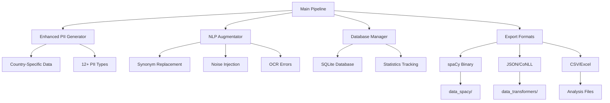

# Enhanced Multi-Country PII Data Generation System

[](https://www.python.org/downloads/)
[](https://opensource.org/licenses/MIT)
[](https://spacy.io/)

A comprehensive system for generating realistic PII (Personally Identifiable Information) training data for Named Entity Recognition (NER) models, specifically designed for Latin American countries with advanced augmentation capabilities.

## 🚀 Key Features

### Core Capabilities
- **Multi-Country Support**: Chile, Mexico, Brazil, and Uruguay with country-specific localization
- **Enhanced PII Types**: 12+ entity types including traditional and location-based PII
- **Advanced NLP Augmentation**: NLTK-based synonym replacement and noise injection
- **Zero Overlapping Entities**: Guaranteed E1010 error prevention
- **🔄 Dual Framework Support**: Export to spaCy (.spacy) and Transformers (CONLL/BIO) formats
- **Database Integration**: Comprehensive tracking and statistics
- **Quality Validation**: Built-in variety and quality metrics

### Supported Entity Types
| Entity Type | Description | Examples |
|-------------|-------------|----------|
| `CUSTOMER_NAME` | Full names with country conventions | Juan Pérez González |
| `ID_NUMBER` | Country-specific ID formats | RUT, CURP, CPF, Cédula |
| `ADDRESS` | Street addresses and cities | Av. Providencia 123 |
| `PHONE_NUMBER` | Country-specific phone formats | +56 9 1234 5678 |
| `EMAIL` | Email addresses with local domains | juan.perez@empresa.cl |
| `AMOUNT` | Monetary amounts with currency | $150.000 CLP |
| `SEQ_NUMBER` | Sequential reference numbers | REF-12345, FOLIO-67890 |
| `DATE` | Various date formats | 15/08/2024, 15 de agosto de 2024 |
| `DIRECTION` | Direction/orientation info | hacia el centro, rumbo norte |
| `LOCATION` | Specific location references | Mall Plaza Norte, Aeropuerto SCL |
| `POSTAL_CODE` | Postal/zip codes | 7500000, 01000 |
| `REGION` | Region/state information | Región Metropolitana |

### Supported Countries
- 🇨🇱 **Chile**: RUT format, +56 phones, CLP currency, Chilean Spanish
- 🇲🇽 **Mexico**: CURP/RFC formats, +52 phones, MXN currency, Mexican Spanish  
- 🇧🇷 **Brazil**: CPF/RG formats, +55 phones, BRL currency, Portuguese
- 🇺🇾 **Uruguay**: Cédula format, +598 phones, UYU currency, Uruguayan Spanish

## 📁 Project Structure

```
DATA_GENERATION/
├── main_pipeline.py              # Main orchestration pipeline
├── requirements.txt              # Python dependencies
├── README.md                     # This file
│
├── generators/                   # PII generation modules
│   ├── enhanced_pii_generator.py # Enhanced PII types and variety
│   └── negative_examples_generator.py
│
├── augmentation/                 # NLP augmentation modules
│   └── nlp_augmentation.py      # NLTK-based augmentation
│
├── Spacy/                       # spaCy-specific modules
│   ├── data_generation_noisy.py # Core spaCy data generator
│   └── config.cfg               # spaCy training configuration
│
├── Transformers/                # Transformer-specific modules
│   ├── transformer_data_generator.py
│   └── train_transformer_ner.py
│
├── data_spacy/                  # spaCy training data
│   ├── train/                   # Training data files
│   ├── dev/                     # Development data files
│   ├── test/                    # Test data files
│   └── README.md               # spaCy data format guide
│
├── data_transformers/           # Transformers training data
│   ├── train/                   # Training data files
│   ├── dev/                     # Development data files
│   ├── test/                    # Test data files
│   └── README.md               # Transformers data format guide
│
├── database/                    # Database management
│   ├── database_manager.py     # SQLite database operations
│   └── schema.sql              # Database schema
│
├── corruption/                  # Data corruption modules
│   └── extreme_corruption.py   # Advanced corruption techniques
│
├── dataset_composer/            # Dataset composition
│   └── mixed_dataset_generator.py
│
├── tests/                       # Test suites
│   └── test_enhanced_pii.py    # Enhanced PII tests
│
├── configs/                     # Configuration files
│   └── optimized_config.cfg    # Optimized spaCy config
│
├── docs/                        # Documentation
│   ├── ARCHITECTURE.md         # System architecture
│   ├── API_REFERENCE.md        # API documentation
│   └── USAGE_EXAMPLES.md       # Usage examples
│
└── examples/                    # Example scripts
    └── complete_workflow.py    # Complete workflow example
```

## 🛠️ Installation

### Prerequisites
- Python 3.8 or higher
- pip package manager

### Quick Installation

```bash
# Clone the repository
git clone https://github.com/andresveraf/DATA_GENERATION.git
cd DATA_GENERATION

# Install dependencies
pip install -r requirements.txt

# Install spaCy language models
python -m spacy download es_core_news_sm
python -m spacy download pt_core_news_sm

# Download NLTK data (will be downloaded automatically on first use)
python -c "import nltk; nltk.download('punkt'); nltk.download('wordnet'); nltk.download('averaged_perceptron_tagger')"
```

### Development Installation

```bash
# Install in development mode
pip install -e .

# Install additional development dependencies
pip install pytest pytest-cov black flake8
```

## 🚀 Quick Start

### Basic Usage

```bash
# 🔵 Generate spaCy format data
python main_pipeline.py --mode mixed-dataset --size 10000 --export-formats spacy --output-dir data_spacy/

# 🟢 Generate Transformers format data  
python main_pipeline.py --mode mixed-dataset --size 10000 --export-formats transformers --output-dir data_transformers/

# 📊 Generate both formats simultaneously
python main_pipeline.py --mode mixed-dataset --size 10000 --export-formats spacy,transformers --composition balanced

# 🌎 Generate country-specific data
python main_pipeline.py --mode mixed-dataset --size 5000 --export-formats json,transformers --composition chile_focused
```

### Advanced Usage

```python
from generators.enhanced_pii_generator import EnhancedPIIGenerator
from augmentation.nlp_augmentation import create_augmentator

# Create enhanced PII generator
generator = EnhancedPIIGenerator()

# Generate all PII types for Chile
pii_data = generator.generate_all_pii_types('chile')
print(pii_data)

# Create NLP augmentator
augmentator = create_augmentator(language="es", synonym_rate=0.3, noise_rate=0.1)

# Augment text while preserving entities
text = "El cliente Juan Pérez con RUT 12.345.678-9 reside en Santiago."
entities = [(11, 21, "CUSTOMER_NAME"), (26, 39, "ID_NUMBER"), (50, 58, "ADDRESS")]
augmented_text, updated_entities = augmentator.augment_text(text, entities)
```

## 📊 System Architecture



## 🎯 Core Functions

### Enhanced PII Generation

```python
from generators.enhanced_pii_generator import EnhancedPIIGenerator

generator = EnhancedPIIGenerator()

# Generate new PII types
direction = generator.generate_direction('chile')      # "hacia el centro"
location = generator.generate_location('chile')       # "Mall Plaza Norte"
postal_code = generator.generate_postal_code('chile') # "7500000"
region = generator.generate_region('chile')           # "Región Metropolitana"

# Enhanced existing types
phone = generator.generate_enhanced_phone('chile')    # "+56 9 1234 5678"
sequence = generator.generate_enhanced_sequence()     # "REF-12345"
date = generator.generate_enhanced_date('chile')      # "15/08/2024"
```

### NLP Augmentation

```python
from augmentation.nlp_augmentation import NLPAugmentator, AugmentationConfig

# Configure augmentation
config = AugmentationConfig(
    synonym_replacement_rate=0.3,  # 30% of non-PII words
    noise_injection_rate=0.1,      # 10% character noise
    language="es"
)

augmentator = NLPAugmentator(config)

# Apply augmentation while preserving PII
text = "El cliente vive en Santiago y trabaja en una empresa."
entities = [(50, 58, "ADDRESS")]  # "Santiago"

augmented_text, updated_entities = augmentator.augment_text(text, entities)
# Result: "El usuario reside en Santiago y labora en una compañía."
```

### Pipeline Operations

```python
from main_pipeline import EnhancedPIIDataPipeline

# Initialize pipeline
pipeline = EnhancedPIIDataPipeline()

# Generate mixed dataset
dataset = pipeline.generate_mixed_dataset(
    size=10000,
    composition_name='balanced',
    export_formats=['json', 'spacy', 'conll']
)

# Generate with extreme corruption
corrupted_dataset = pipeline.generate_extreme_corruption_dataset(
    base_documents=dataset['train_documents'],
    corruption_levels=['medium', 'extreme'],
    samples_per_level=1000
)
```

## 📈 Data Quality Metrics

### Variety Validation

```python
from generators.enhanced_pii_generator import validate_pii_variety

# Validate PII variety for quality assurance
variety_report = validate_pii_variety('chile', samples=1000)

for pii_type, metrics in variety_report.items():
    print(f"{pii_type}: {metrics['variety_percentage']:.1f}% variety")
    print(f"  Sufficient variety: {metrics['sufficient_variety']}")
```

### Expected Quality Metrics
- **Variety**: >70% unique values per PII type
- **Entity Coverage**: All 12 PII types represented
- **Zero Overlaps**: Guaranteed no E1010 errors
- **Country Localization**: Authentic formats per country
- **Augmentation Preservation**: PII entities maintained during augmentation

## 🔧 Configuration Options

### Main Pipeline Configuration

```bash
# Dataset composition options
python main_pipeline.py --mode mixed-dataset --composition balanced    # Equal distribution
python main_pipeline.py --mode mixed-dataset --composition pii-heavy   # More PII entities
python main_pipeline.py --mode mixed-dataset --composition minimal     # Fewer entities

# Export format options
--export-formats json              # JSON format only
--export-formats spacy             # spaCy binary format (.spacy)
--export-formats transformers      # CONLL/BIO format (.conll)
--export-formats json,spacy,transformers  # Multiple formats
--export-formats csv               # Analysis format

# Country-specific generation
--country chile                    # Chile only
--country mexico                   # Mexico only
--country all                      # All countries

# Augmentation options
--augmentation-enabled             # Enable NLP augmentation
--augmentation-rate 0.3            # 30% augmentation rate
--augmentation-types synonyms,noise # Specific augmentation types
```

## 📋 Format Specifications

### 🔵 spaCy Format (.spacy)
- **Format**: DocBin binary format optimized for spaCy v3+
- **Structure**: Serialized Doc objects with character-level entity spans
- **Files**: `train.spacy`, `dev.spacy`
- **Usage**: Direct loading into spaCy training pipeline
- **Advantages**: Fast loading, memory efficient, preserves tokenization

```python
# Loading spaCy format
import spacy
from spacy.tokens import DocBin

nlp = spacy.blank("es")
doc_bin = DocBin().from_disk("data_spacy/train.spacy")
docs = list(doc_bin.get_docs(nlp.vocab))
```

### 🟢 Transformers Format (.conll)
- **Format**: CONLL-2003 format with BIO tagging scheme
- **Structure**: Word-level tokens with BIO tags (tab-separated)
- **Files**: `train.conll`, `dev.conll`
- **Usage**: Compatible with HuggingFace Transformers, spaCy, AllenNLP
- **Tagging**: B-LABEL (Beginning), I-LABEL (Inside), O (Outside)

```
Juan	B-CUSTOMER_NAME
Pérez	I-CUSTOMER_NAME
vive	O
en	O
Santiago	B-ADDRESS
```

### spaCy Training Configuration

```bash
# Generate spaCy training data
python main_pipeline.py --mode mixed-dataset --size 20000 --export-formats spacy --output-dir data_spacy/

# Train spaCy model
python -m spacy train configs/optimized_config.cfg --output ./models --paths.train ./data_spacy/train.spacy --paths.dev ./data_spacy/dev.spacy
```

### Transformers Training Configuration

```bash
# Generate transformer training data
python main_pipeline.py --mode mixed-dataset --size 15000 --export-formats json,conll --output-dir data_transformers/

# Train transformer model
cd Transformers/
python train_transformer_ner.py --data_dir ../data_transformers/ --model_name dccuchile/bert-base-spanish-wwm-uncased
```

## 🧪 Testing

### Run All Tests

```bash
# Run comprehensive test suite
python -m pytest tests/ -v

# Run specific test modules
python tests/test_enhanced_pii.py

# Run with coverage
python -m pytest tests/ --cov=generators --cov=augmentation --cov-report=html
```

### Manual Testing

```python
# Test enhanced PII generation
python -c "
from generators.enhanced_pii_generator import EnhancedPIIGenerator
generator = EnhancedPIIGenerator()
pii_data = generator.generate_all_pii_types('chile')
for pii_type, value in pii_data.items():
    print(f'{pii_type}: {value}')
"

# Test NLP augmentation
python -c "
from augmentation.nlp_augmentation import create_augmentator
augmentator = create_augmentator()
text = 'El cliente Juan Pérez vive en Santiago.'
entities = [(11, 21, 'CUSTOMER_NAME'), (31, 39, 'ADDRESS')]
augmented, _ = augmentator.augment_text(text, entities)
print(f'Original: {text}')
print(f'Augmented: {augmented}')
"
```

## 📚 Usage Examples

### Example 1: Basic Dataset Generation

```python
from main_pipeline import EnhancedPIIDataPipeline

# Create pipeline
pipeline = EnhancedPIIDataPipeline()

# Generate balanced dataset
dataset = pipeline.generate_mixed_dataset(
    size=5000,
    composition_name='balanced',
    output_dir='output/',
    export_formats=['json', 'spacy']
)

print(f"Generated {len(dataset['train_documents'])} training documents")
print(f"Generated {len(dataset['dev_documents'])} development documents")
```

### Example 2: Country-Specific Generation with Augmentation

```python
from generators.enhanced_pii_generator import EnhancedPIIGenerator
from augmentation.nlp_augmentation import create_augmentator

# Generate Chilean PII data
generator = EnhancedPIIGenerator()
pii_data = generator.generate_all_pii_types('chile')

# Create training sentence
text = f"Cliente {pii_data['CUSTOMER_NAME']} con {pii_data['ID_NUMBER']} reside en {pii_data['ADDRESS']}."

# Define entities
entities = [
    (8, 8 + len(pii_data['CUSTOMER_NAME']), "CUSTOMER_NAME"),
    (13 + len(pii_data['CUSTOMER_NAME']), 13 + len(pii_data['CUSTOMER_NAME']) + len(pii_data['ID_NUMBER']), "ID_NUMBER"),
    (25 + len(pii_data['CUSTOMER_NAME']) + len(pii_data['ID_NUMBER']), 25 + len(pii_data['CUSTOMER_NAME']) + len(pii_data['ID_NUMBER']) + len(pii_data['ADDRESS']), "ADDRESS")
]

# Apply augmentation
augmentator = create_augmentator(language="es", synonym_rate=0.3)
augmented_text, updated_entities = augmentator.augment_text(text, entities)

print(f"Original: {text}")
print(f"Augmented: {augmented_text}")
```

### Example 3: Batch Processing with Quality Validation

```python
from generators.enhanced_pii_generator import validate_pii_variety
from main_pipeline import EnhancedPIIDataPipeline

# Generate large dataset
pipeline = EnhancedPIIDataPipeline()
dataset = pipeline.generate_mixed_dataset(size=10000, composition_name='balanced')

# Validate quality
variety_report = validate_pii_variety('chile', samples=1000)

# Print quality metrics
print("Quality Validation Report:")
print("-" * 40)
for pii_type, metrics in variety_report.items():
    status = "✓" if metrics['sufficient_variety'] else "✗"
    print(f"{status} {pii_type}: {metrics['variety_percentage']:.1f}% variety")
```

## 🔍 Troubleshooting

### Common Issues

1. **NLTK Data Missing**
   ```bash
   python -c "import nltk; nltk.download('punkt'); nltk.download('wordnet')"
   ```

2. **spaCy Model Missing**
   ```bash
   python -m spacy download es_core_news_sm
   python -m spacy download pt_core_news_sm
   ```

3. **Import Errors**
   ```bash
   # Ensure project root is in Python path
   export PYTHONPATH="${PYTHONPATH}:$(pwd)"
   ```

4. **Database Permissions**
   ```bash
   # Ensure write permissions for database directory
   chmod 755 database/
   ```

### Performance Optimization

- **Large Datasets**: Use batch processing with `--batch-size` parameter
- **Memory Usage**: Enable garbage collection with `--gc-enabled`
- **Parallel Processing**: Use `--workers` parameter for multi-processing
- **Database Optimization**: Use `--db-batch-size` for bulk inserts

## 🤝 Contributing

### Development Setup

```bash
# Fork and clone the repository
git clone https://github.com/yourusername/DATA_GENERATION.git
cd DATA_GENERATION

# Create virtual environment
python -m venv venv
source venv/bin/activate  # On Windows: venv\Scripts\activate

# Install in development mode
pip install -e .
pip install -r requirements.txt

# Install development dependencies
pip install pytest pytest-cov black flake8 mypy

# Run tests
python -m pytest tests/
```

### Code Style

```bash
# Format code
black generators/ augmentation/ tests/

# Check style
flake8 generators/ augmentation/ tests/

# Type checking
mypy generators/ augmentation/
```

### Submitting Changes

1. Create a feature branch: `git checkout -b feature/new-pii-type`
2. Make your changes and add tests
3. Run the test suite: `python -m pytest tests/`
4. Format your code: `black .`
5. Submit a pull request

## 📄 License

This project is licensed under the MIT License - see the [LICENSE](LICENSE) file for details.

## 👥 Authors

- **Andrés Vera Figueroa** - *Original Author* - [andresveraf](https://github.com/andresveraf)
- **Codegen AI** - *Enhanced Features* - Enhanced PII types, NLP augmentation, and comprehensive documentation

## 🙏 Acknowledgments

- spaCy team for the excellent NLP framework
- Hugging Face for transformer models and datasets library
- NLTK team for natural language processing tools
- The open-source community for inspiration and feedback

## 📞 Support

For questions, issues, or contributions:

- **Issues**: [GitHub Issues](https://github.com/andresveraf/DATA_GENERATION/issues)
- **Discussions**: [GitHub Discussions](https://github.com/andresveraf/DATA_GENERATION/discussions)
- **Email**: Contact through GitHub profile

---

**Made with ❤️ for the NLP and AI community**
