# Latin American Customer Data Generator for NLP Training

[](https://python.org)
[](https://spacy.io)
[](LICENSE)

## 🌎 Overview

This project generates realistic customer data for Latin American countries specifically designed for Named Entity Recognition (NER) training. It creates balanced datasets with labeled entities for customer service and financial NLP applications, supporting 5 Latin American countries with authentic regional characteristics.

### 🎯 Key Features

- **Multi-country Support**: Chile, Argentina, Brazil, Uruguay, and Mexico
- **Realistic Data Generation**: Country-specific phone formats, addresses, and ID numbers
- **NER-Ready Output**: spaCy-compatible training data with entity annotations
- **Flexible Dataset Sizes**: Configurable training and validation set sizes
- **Multiple Complexity Modes**: Different data complexity levels for various training scenarios
- **Export Formats**: Direct export to `.spacy` format for immediate training

### 🏷️ Supported Entity Types

| Entity Type | Description | Example |
|-------------|-------------|---------|
| `CUSTOMER_NAME` | Full names (first + last) | "María González" |
| `ID_NUMBER` | Government identification numbers | "12.345.678-9" (Chile) |
| `ADDRESS` | Street addresses and cities | "Av. Libertador 1234, Santiago" |
| `PHONE_NUMBER` | Country-specific phone formats | "+56 9 8765 4321" |
| `EMAIL` | Email addresses | "maria.gonzalez@email.com" |
| `AMOUNT` | Monetary amounts with currency | "$125.50 CLP" |
| `SEQ_NUMBER` | Sequential reference numbers | "CL-10001" |

## 🗺️ Supported Countries

| Country | Code | Language | Currency | ID Format |
|---------|------|----------|----------|-----------|
| 🇨🇱 Chile | CL | Spanish | CLP | 12.345.678-9 |
| 🇦🇷 Argentina | AR | Spanish | ARS | 12.345.678 |
| 🇧🇷 Brazil | BR | Portuguese | BRL | 123.456.789-01 |
| 🇺🇾 Uruguay | UY | Spanish | UYU | 1.234.567-8 |
| 🇲🇽 Mexico | MX | Spanish | MXN | ABCD123456EFG |

## 📊 Architecture Overview


## 🚀 Quick Start

### Prerequisites

```bash
# Install Python 3.8+
python3 --version

# Install required packages
pip install spacy

# Download Spanish language model
python3 -m spacy download es_core_news_lg
```

### Basic Usage

```python
from data_generation import generate_example, create_training_dataset

# Generate a single example
sentence, annotations = generate_example("CL")
print(f"Text: {sentence}")
print(f"Entities: {annotations['entities']}")

# Create training dataset
create_training_dataset(
    train_size=10000,
    dev_size=2500,
    output_dir="./datasets"
)
```

### Command Line Usage

```bash
# Demo mode - show examples
python3 data_generation.py

# Create training dataset with default sizes (8000 train, 2000 dev)
python3 data_generation.py --mode create-dataset

# Create custom-sized dataset
python3 data_generation.py --mode create-dataset --train-size 15000 --dev-size 3000

# Specify output directory
python3 data_generation.py --mode create-dataset --output-dir ./my_datasets
```

## ⚙️ Configuration Guide

### 📏 Configuring Dataset Sizes

There are **three main ways** to configure the dataset size:

#### 1. Command Line Arguments (Recommended)

```bash
# Small dataset for testing
python3 data_generation.py --mode create-dataset --train-size 1000 --dev-size 250

# Medium dataset for development
python3 data_generation.py --mode create-dataset --train-size 8000 --dev-size 2000

# Large dataset for production
python3 data_generation.py --mode create-dataset --train-size 50000 --dev-size 10000
```

#### 2. Function Parameters

```python
# Direct function call
create_training_dataset(
    train_size=25000,    # Training examples
    dev_size=5000,       # Validation examples  
    output_dir="./data"  # Output directory
)

# Using make_docbin directly
docbin, stats = make_docbin(
    n_total=100000,      # Total examples
    balance=True,        # Balance across countries
    output_dir="."       # Output directory
)
```

#### 3. Modifying Default Values

Edit the default values in `data_generation.py`:

```python
# Line ~877: Command line defaults
parser.add_argument("--train-size", type=int, default=15000, help="Training set size")
parser.add_argument("--dev-size", type=int, default=3000, help="Development set size")

# Line ~655: Function default
def make_docbin(n_total: int = 200000, balance: bool = True, output_dir: str = "."):
```

### 📊 Recommended Dataset Sizes

| Use Case | Training Size | Dev Size | Total | Memory | Training Time |
|----------|---------------|----------|-------|--------|---------------|
| **Quick Testing** | 100 | 25 | 125 | ~1MB | 1-2 min |
| **Development** | 1,000 | 250 | 1,250 | ~10MB | 5-10 min |
| **Small Model** | 5,000 | 1,000 | 6,000 | ~50MB | 15-30 min |
| **Medium Model** | 15,000 | 3,000 | 18,000 | ~150MB | 1-2 hours |
| **Large Model** | 50,000 | 10,000 | 60,000 | ~500MB | 3-5 hours |
| **Production** | 100,000+ | 20,000+ | 120,000+ | ~1GB+ | 6+ hours |

## 🔄 Generation Workflow


## 🎛️ Generation Modes

The system supports five different complexity modes for training data:

### Mode Comparison


### Example Outputs by Mode

```python
# Full mode example
"Cliente María González, RUT 12.345.678-9, vive en Av. Libertador 1234, Santiago. 
Teléfono +56 9 8765 4321, email maria.gonzalez@email.com. 
Monto: $125.50 CLP, Ref: CL-10001"

# Address only mode
"Dirección del cliente: Av. Libertador 1234, Santiago"

# ID only mode  
"RUT del cliente: 12.345.678-9"

# Contact only mode
"Contacto: +56 9 8765 4321, email maria.gonzalez@email.com"

# Financial only mode
"Transacción por $125.50 CLP, Referencia: CL-10001"
```

## 🗃️ Output Files Structure


### Statistics Report Format

```json
{
  "train_stats": {
    "total_examples": 8000,
    "countries": {
      "CL": 1600,
      "AR": 1600,
      "BR": 1600,
      "UY": 1600,
      "MX": 1600
    },
    "entities": {
      "CUSTOMER_NAME": 8000,
      "ID_NUMBER": 8000,
      "ADDRESS": 8000,
      "PHONE_NUMBER": 8000,
      "EMAIL": 8000,
      "AMOUNT": 8000,
      "SEQ_NUMBER": 8000
    }
  },
  "dev_stats": {
    "total_examples": 2000,
    // ... similar structure
  }
}
```

## 🧪 Testing and Validation

### Quick Functionality Test

```python
from data_generation import quick_test

# Run built-in tests
quick_test()
```

### Manual Testing

```python
# Test different countries
countries = ["CL", "AR", "BR", "UY", "MX"]
for country in countries:
    sentence, annotations = generate_example(country)
    print(f"{country}: {sentence}")

# Test different modes
modes = ["full", "addr_only", "id_only", "contact_only", "financial_only"]
for mode in modes:
    sentence, annotations = generate_example_with_mode("CL", mode)
    print(f"{mode}: {len(annotations['entities'])} entities")
```

## 📈 Performance Considerations

### Memory Usage

```mermaid
flowchart TB
    subgraph "Memory Requirements"
        A[Dataset Size] --> B{Memory Impact}
        B --> C["1K examples ≈ 10MB"]
        B --> D["10K examples ≈ 100MB"]
        B --> E["100K examples ≈ 1GB"]
        
        F[spaCy Model] --> G["es_core_news_lg ≈ 570MB"]
        
        H[Python Process] --> I["Base overhead ≈ 50MB"]
    end
    
    style A fill:#e1f5fe
    style G fill:#fff3e0
    style I fill:#f3e5f5
```



### Generation Speed

- **Small datasets** (1K): ~30 seconds
- **Medium datasets** (10K): ~5 minutes  
- **Large datasets** (100K): ~45 minutes
- **Rate**: ~40-50 examples/second

### Optimization Tips

1. **Use balanced generation** (`balance=True`) for even country distribution
2. **Process in chunks** for very large datasets (>100K)
3. **Monitor memory usage** with large datasets
4. **Use SSD storage** for faster file I/O

## 🔧 Advanced Usage

### Custom Country Configuration

```python
# Add custom country data
CUSTOM_COUNTRIES = {
    "CO": {
        "name": "Colombia", 
        "currency": "COP",
        "phone_prefix": "+57",
        "id_format": "cc_format"
    }
}
```

### Custom Entity Templates

```python
# Create custom generation templates
def custom_generate_example(country_code: str) -> Tuple[str, Dict]:
    """Custom generation logic"""
    # Your custom implementation
    pass
```

### Batch Processing

```python
def create_multiple_datasets():
    """Create multiple datasets with different configurations"""
    configurations = [
        {"train_size": 5000, "dev_size": 1000, "output_dir": "./small"},
        {"train_size": 15000, "dev_size": 3000, "output_dir": "./medium"},
        {"train_size": 50000, "dev_size": 10000, "output_dir": "./large"}
    ]
    
    for config in configurations:
        create_training_dataset(**config)
```

## 🐛 Troubleshooting

### Common Issues

| Issue | Symptoms | Solution |
|-------|----------|----------|
| **spaCy Model Missing** | `OSError: Can't find model` | Run `python3 -m spacy download es_core_news_lg` |
| **Memory Error** | `MemoryError` during generation | Reduce dataset size or process in chunks |
| **Import Error** | `ModuleNotFoundError: No module named 'spacy'` | Install spaCy: `pip install spacy` |
| **Permission Error** | Can't write output files | Check directory permissions or change output directory |

### Debugging Mode

```python
# Enable verbose output
import logging
logging.basicConfig(level=logging.DEBUG)

# Test individual components
sentence, annotations = generate_example("CL")
print(f"Generated: {sentence}")
print(f"Entities: {annotations}")
```

## 📚 API Reference

### Core Functions

#### `generate_example(country_code: str) -> Tuple[str, Dict]`
Generates a single customer example with all entity types.

**Parameters:**
- `country_code` (str): Two-letter country code (CL, AR, BR, UY, MX)

**Returns:**
- `sentence` (str): Generated text with customer information
- `annotations` (Dict): Entity annotations in spaCy format

#### `generate_example_with_mode(country_code: str, mode: str) -> Tuple[str, Dict]`
Generates an example with specific entity types based on mode.

**Parameters:**
- `country_code` (str): Two-letter country code
- `mode` (str): Generation mode (full, addr_only, id_only, contact_only, financial_only)

**Returns:**
- `sentence` (str): Generated text
- `annotations` (Dict): Entity annotations

#### `make_docbin(n_total: int, balance: bool, output_dir: str) -> Tuple[DocBin, Dict]`
Creates a spaCy DocBin with specified number of examples.

**Parameters:**
- `n_total` (int): Total number of examples to generate
- `balance` (bool): Whether to balance across countries
- `output_dir` (str): Directory to save output files

**Returns:**
- `docbin` (DocBin): spaCy DocBin object
- `stats` (Dict): Generation statistics

#### `create_training_dataset(train_size: int, dev_size: int, output_dir: str)`
Creates complete training and development datasets.

**Parameters:**
- `train_size` (int): Number of training examples
- `dev_size` (int): Number of development examples  
- `output_dir` (str): Output directory path

## 🤝 Contributing

### Development Setup

```bash
# Clone the repository
git clone https://github.com/yourusername/DATA_GENERATION.git
cd DATA_GENERATION

# Install dependencies
pip install spacy
python3 -m spacy download es_core_news_lg

# Run tests
python3 data_generation.py
```

### Adding New Countries

1. **Add country data** to the configuration dictionaries
2. **Implement country-specific logic** for ID formats, phone numbers, addresses
3. **Add test cases** for the new country
4. **Update documentation** with new country information

### Code Style

- Follow PEP 8 style guidelines
- Add type hints for all functions
- Include comprehensive docstrings
- Add unit tests for new functionality

## � Testing Your Trained Model

Once you've trained your NER model, you can test it with the provided PII detection scripts:

### Quick Testing

Use the simple test script for basic verification:

```bash
python3 quick_test.py
```

This script:
- Loads your trained model (falls back to base Spanish model)
- Tests with a predefined example
- Shows detected entities

### Comprehensive Testing

Use the full-featured test script for detailed analysis:

```bash
python3 test_pii_ner.py
```

**Features:**
- **Interactive Mode**: Enter your own text to analyze
- **Predefined Tests**: 10+ example texts covering different scenarios
- **Detailed Analysis**: Entity positions, context, and groupings
- **Model Information**: Shows recognized entity types and capabilities

**Example Test Results:**
```
📝 Testing: El cliente Juan Carlos González con RUT 15.234.567-8 vive en Av. Providencia 123, Santiago.

🎯 Found 3 entities:
 1. CUSTOMER_NAME | Juan Carlos González  | Position: 11-30
 2. ID_NUMBER     | 15.234.567-8         | Position: 39-51
 3. ADDRESS       | Av. Providencia 123  | Position: 61-80
 4. ADDRESS       | Santiago             | Position: 82-90
```

### Testing Custom Text

To test your own text, modify `quick_test.py`:

```python
# Change this line to test your own text
test_text = "Your custom text with names, RUT, and addresses here"
```

### Supported Entity Detection

The trained model can identify:

| Entity | Example | Context |
|--------|---------|---------|
| **Names** | Juan Carlos González Rodríguez | Compound first names + double surnames |
| **RUT/ID** | 15.234.567-8, 32456789, 123.456.789-01 | Country-specific formats |
| **Addresses** | Av. Providencia 123, Santiago | Street + number, cities |
| **Phone** | +56 9 8765 4321 | Country codes + local formats |
| **Email** | juan.gonzalez@gmail.com | Based on names |
| **Amounts** | $45,000 CLP, R$ 1,200 BRL | Local currencies |
| **References** | 7009808, 57575-A, CL-10001 | Various sequence formats |

### Performance Tips

1. **Model Training**: Use at least 80K training examples for high accuracy
2. **Entity Variety**: Include diverse text patterns in your training data
3. **Testing**: Test with real-world text samples from your target domain
4. **Validation**: Use the development set to monitor training progress

## �📄 License

This project is licensed under the MIT License - see the [LICENSE](LICENSE) file for details.

## 🙏 Acknowledgments

- **spaCy Team** for the excellent NLP library
- **Latin American communities** for inspiration on realistic data patterns
- **Open source contributors** who make projects like this possible

## 📞 Support

For questions, issues, or contributions:

1. **Check the troubleshooting section** above
2. **Search existing issues** on GitHub
3. **Create a new issue** with detailed information
4. **Join our community discussions** for general questions

---

**Made with ❤️ for the Latin American NLP community**
