# Technical Documentation - Latin American NLP Data Generator

## 🏗️ System Architecture

### Component Interaction Diagram


## 🔄 Data Flow Architecture

### End-to-End Data Processing


## 🎯 Entity Recognition Pipeline

### NER Processing Workflow


## 🌍 Country-Specific Data Models

### Multi-Country Data Generation

```mermaid
flowchart TB
    subgraph "Country Selection Logic"
        START[Start Generation] --> COUNTRY{Select Country}
        COUNTRY -->|CL| CHILE[Chile Pipeline]
        COUNTRY -->|AR| ARGENTINA[Argentina Pipeline]
        COUNTRY -->|BR| BRAZIL[Brazil Pipeline]
        COUNTRY -->|UY| URUGUAY[Uruguay Pipeline]
        COUNTRY -->|MX| MEXICO[Mexico Pipeline]
    end
    
    subgraph "Chile (CL) - Spanish"
        CHILE --> CL_NAME[Names: María, José, Carmen]
        CHILE --> CL_ID[ID: 12.345.678-9]
        CHILE --> CL_PHONE[Phone: +56 9 8765 4321]
        CHILE --> CL_ADDR[Address: Santiago, Valparaíso]
        CHILE --> CL_CURR[Currency: CLP]
    end
    
    subgraph "Argentina (AR) - Spanish"
        ARGENTINA --> AR_NAME[Names: Juan, Ana, Carlos]
        ARGENTINA --> AR_ID[ID: 12.345.678]
        ARGENTINA --> AR_PHONE[Phone: +54 11 1234 5678]
        ARGENTINA --> AR_ADDR[Address: Buenos Aires, Córdoba]
        ARGENTINA --> AR_CURR[Currency: ARS]
    end
    
    subgraph "Brazil (BR) - Portuguese"
        BRAZIL --> BR_NAME[Names: João, Maria, Pedro]
        BRAZIL --> BR_ID[ID: 123.456.789-01]
        BRAZIL --> BR_PHONE[Phone: +55 11 98765 4321]
        BRAZIL --> BR_ADDR[Address: São Paulo, Rio de Janeiro]
        BRAZIL --> BR_CURR[Currency: BRL]
    end
    
    subgraph "Data Consolidation"
        CL_CURR --> CONSOLIDATE[Consolidate Country Data]
        AR_CURR --> CONSOLIDATE
        BR_CURR --> CONSOLIDATE
        CONSOLIDATE --> TEMPLATE[Generate Text Template]
        TEMPLATE --> OUTPUT[Final Customer Record]
    end
    
    style START fill:#4caf50
    style COUNTRY fill:#ff9800
    style CONSOLIDATE fill:#2196f3
    style OUTPUT fill:#8bc34a
```



## 📊 Dataset Size Configuration Matrix

### Size Impact Analysis


## 🔧 Generation Mode Comparison

### Mode-Specific Entity Distribution


## 🚀 Performance Optimization Strategies

### Scalability Architecture


## 🔍 Quality Assurance Pipeline

### Testing and Validation Workflow


## 📈 Monitoring and Analytics

### Runtime Performance Dashboard


## 🧪 PII Detection Testing Framework

### Testing Script Architecture


### Testing Script Implementation Details

#### quick_test.py Architecture

```python
def quick_test():
    """
    Lightweight testing function for basic model validation
    
    Flow:
    1. Attempt to load trained model (./model/)
    2. Fallback to base Spanish models if needed
    3. Process predefined test text
    4. Display detected entities with labels
    5. Provide modification guidance
    """
    
    # Model Loading Priority Chain
    # 1. ./model/ (trained model)
    # 2. es_core_news_lg (large base model)  
    # 3. es_core_news_sm (small base model)
    # 4. Error if none available
```

#### test_pii_ner.py Architecture

```python
class PIITester:
    """
    Comprehensive PII detection testing framework
    
    Features:
    - Model validation and fallback handling
    - Interactive text input mode
    - Predefined test suite execution
    - Detailed entity analysis and reporting
    - Context visualization around entities
    - Performance metrics collection
    """
    
    def load_trained_model(self, model_path: str) -> spacy.Language:
        """Load and validate trained spaCy model"""
        
    def test_text_with_model(self, nlp, text: str, show_details: bool) -> None:
        """Process text and analyze detected entities"""
        
    def interactive_mode(self, nlp) -> None:
        """Interactive testing with user input"""
        
    def run_predefined_tests(self, nlp) -> None:
        """Execute comprehensive test suite"""
```

### Test Case Coverage Matrix

| Test Category | Entity Types | Languages | Countries | Purpose |
|---------------|-------------|-----------|-----------|---------|
| **Basic Validation** | NAME, ID, ADDRESS | ES | CL | Core functionality |
| **Compound Names** | CUSTOMER_NAME | ES | CL, AR, UY, MX | Second names/surnames |
| **Multi-Country IDs** | ID_NUMBER | ES, PT | All 5 | Format variations |
| **Address Variations** | ADDRESS | ES, PT | All 5 | Street + city patterns |
| **Contact Info** | PHONE, EMAIL | ES, PT | All 5 | Communication data |
| **Financial Data** | AMOUNT, SEQ_NUMBER | ES, PT | All 5 | Transaction info |
| **Mixed Entities** | All types | ES, PT | All 5 | Real-world complexity |
| **Edge Cases** | Partial matches | ES | CL | Error handling |

### Performance Testing Metrics

```python
class TestingMetrics:
    """
    Metrics collection for PII detection testing
    """
    
    precision: float        # True positives / (True positives + False positives)
    recall: float          # True positives / (True positives + False negatives)  
    f1_score: float        # 2 * (precision * recall) / (precision + recall)
    
    entity_accuracy: Dict[str, float]  # Accuracy per entity type
    processing_speed: float            # Examples processed per second
    memory_usage: float               # Peak memory during testing
    
    def calculate_metrics(self, predictions: List, ground_truth: List) -> None:
        """Calculate comprehensive testing metrics"""
        
    def generate_report(self) -> str:
        """Generate formatted performance report"""
```

### Error Handling and Diagnostics

```python
class TestingDiagnostics:
    """
    Diagnostic tools for PII testing troubleshooting
    """
    
    @staticmethod
    def diagnose_model_load_failure(model_path: str) -> List[str]:
        """Analyze and report model loading issues"""
        
    @staticmethod  
    def analyze_entity_mismatches(predicted: List, expected: List) -> Dict:
        """Compare predicted vs expected entities"""
        
    @staticmethod
    def validate_text_encoding(text: str) -> bool:
        """Check text encoding compatibility"""
        
    @staticmethod
    def check_spacy_installation() -> Dict[str, str]:
        """Verify spaCy installation and models"""
```

## 🔗 Integration Points

### External System Integration


---

This technical documentation provides detailed insights into the system architecture, data flows, and optimization strategies for the Latin American NLP Data Generator.
